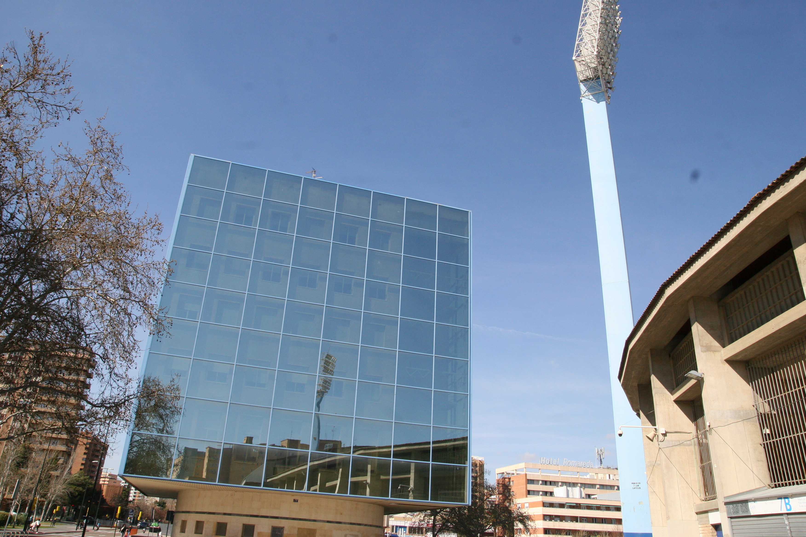
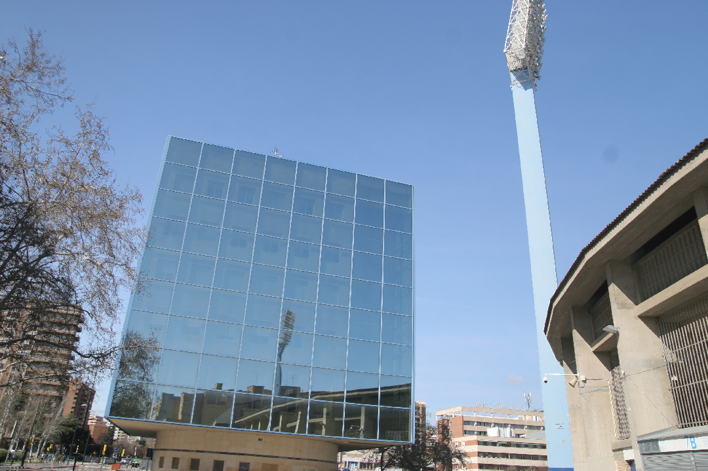
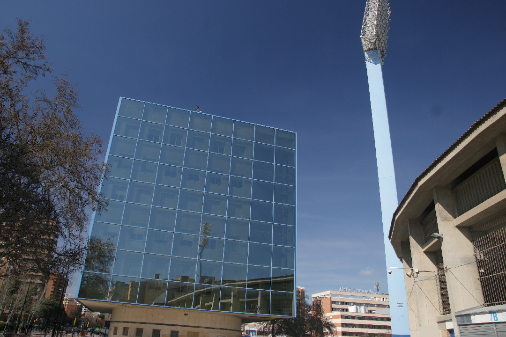
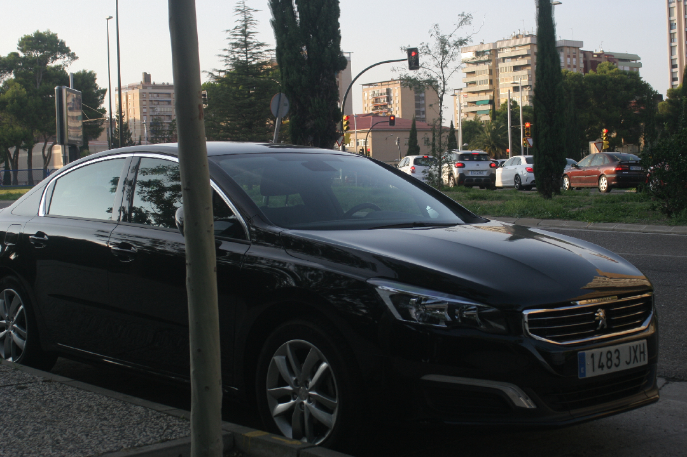
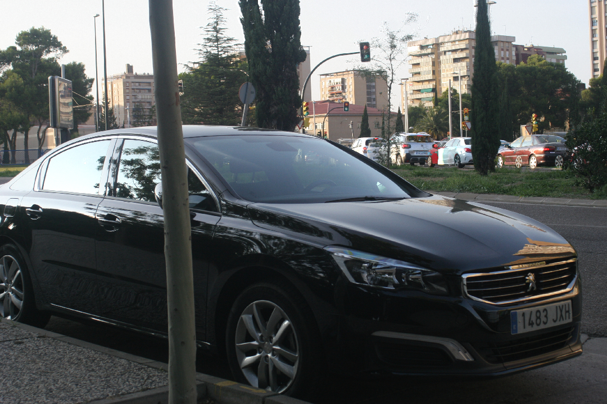
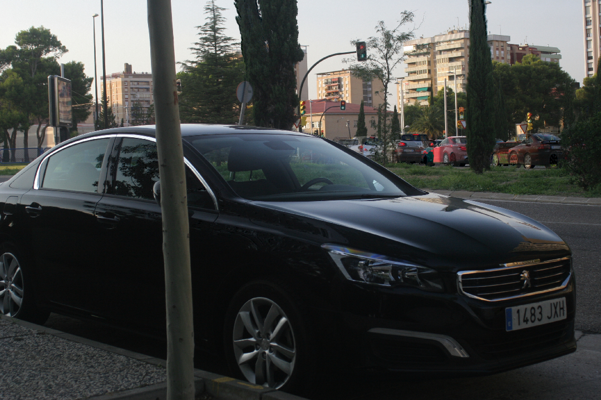
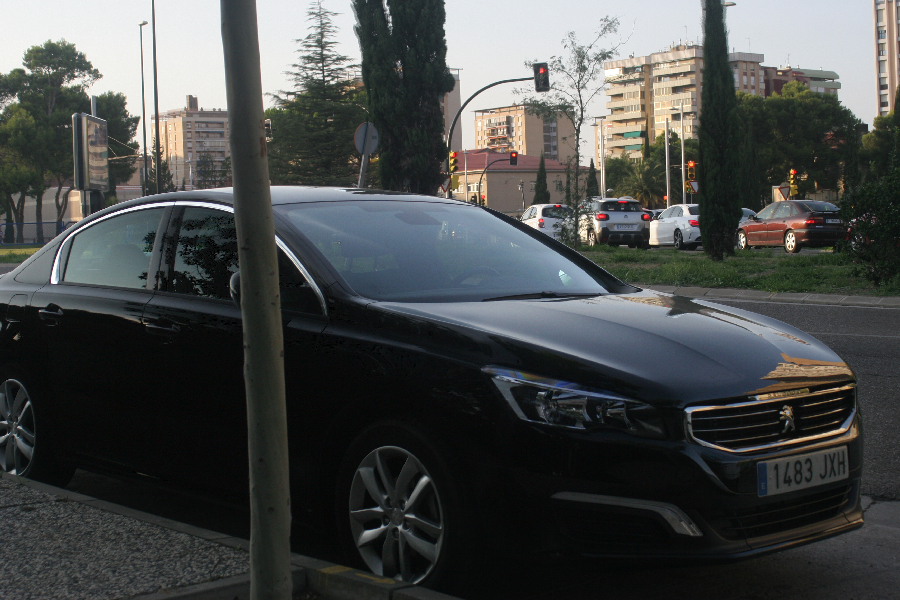

## Projects
-[**Polarization Mapping**](#polarization): a tool to edit images with polarized light. An investigation done with my end-of-degree project suppervisor, Adolfo Muñoz, presented in the Spanish Conference on Computer Graphics 2019 (CEIG2019).

-[**Windmill Engine**](#windmill): a personal project to implement a game engine from scratch using **C++** and **Vulkan**.

-[**Nehan**](#nehan): master final project in progress. Working together with a team of students of different areas, programmers, designers, artits, producers and marketing people.

-[**Chess Thing**](#chess-thing): a game for the _2-Buttons Game Jam 2019_ made with Unity.

-[**Duality**](#duality): my first videogame in unity done while I was on my second degree year

### Contact
**Mail:** ferdelmo1996@gmail.com

**Tlf.:** +34 685 272 972

## Polarization Mapping
This is a project derived from my end-of-degree project in the Universidad de Zaragoza under the suppervision of Adolfo Muñoz. Our work ended up in an invetigation paper called **Polarization Mapping**, which was presented in the Spanish Congress of Computer Graphics(CEIG2019). The paper was selected as **best paper of the Spanish Conference on Computer Graphics 2019 (CEIG2019)** and was published through Computers & Graphics.

Our work present a method to edit images with polarized light, together with a capture method. The main idea of the work is to modify the polarization of an image as a post-process effect, simlarly to tone mapping with HDR. Our method allow different types of filters. First of all it allows to reproduce any polarizing filter existing in hardware and even create software filters that are hardly reproducible by hardware. We also present two kinds of filters to maximize (or minimize) different image parameters: luminance, saturation and contrast. These filters can be applied with two approach, global filters, that basically select the best linear polarizer to maximize that parameter. And local filters, that apply a different linear polarizer per pixel to maximize the parameter. The local approach generate results that are imposible to reproduce by hardware and allows intersting effects, like minimizing the reflects on any surface in the image.

[Project page](http://giga.cps.unizar.es/~amunoz/projects/CG2019_polarization/)

[DOI](https://doi.org/10.1016/j.cag.2019.06.011)

A small sample of the results obtainable with our application can be seen below.

    

        
        <figcaption>Original image</figcaption>
    

    

        
        <figcaption>Luminance maximization per pixel</figcaption>
    

    

        
        <figcaption>Luminance minimization per pixel</figcaption>
    

    

        
        <figcaption>Original image</figcaption>
    

    

        
        <figcaption>Luminance maximization per pixel</figcaption>
    

    

        
        <figcaption>Luminance minimization per pixel</figcaption>
    

    

        
        <figcaption>Image edited with our brush based tool</figcaption>
    

## Windmill Engine
This is my personal project of doing a videogame engine from scratch using vulkan as graphics API. It is still in its first steps, and currently working on the render engine with vulkan. Basic features like render meshes, lighting without shadows, and the separation between the main loop and the render thread are implemented.

[Repository](https://github.com/ferdelmo/WindmillEngine)

##  Nehan ##
This is my master final project that is being developed together with a team of students from different areas. We are using Unreal Engine 4 as our main deveop tool. For now we can't show nothing of the game until we pass some university milestones.

## Chess Thing

**Chess Thing** is a game made for the _2-Buttons Game Jam 2019_ which has the restriction that the game need to be played and used with only 2 buttons (obiusly). In the game you control a pawn in an infinity chess table who had to advanced avoiding the other pieces that will attack you. You have a limited time to do a move, that can be: stay still, advance one square or advance two. With this limited movement you have to advance all the square that you can. 

One interesting thing done, taking into account the limited time of development (4 days) is the AI, which have three different difficulties, limiting the number of moves the AI can done, controling how many of the positions the player can go will threat, etc. 

The game can be played [here](https://ferdelmo.itch.io/chess-thing)

[Source Code](https://github.com/ferdelmo/ChessThing) (It's a game jam, so expect any kind of hacks there)

## Duality

This was my first videogame project as an undergraduate. Is a small android game, inspired by The Impossible Game and Geometry Dash that basically put you in control of two squares instead of one, raising the difficulty. It was my first experience with Unity, which I have been using since 2015/2016 to do some other personal projects that ends up unfinished, a couple of game jams and also in my internship in Padaone Games.

The game is published in Google Play ([link](https://play.google.com/store/apps/details?id=com.Delmogames.Duality)).
